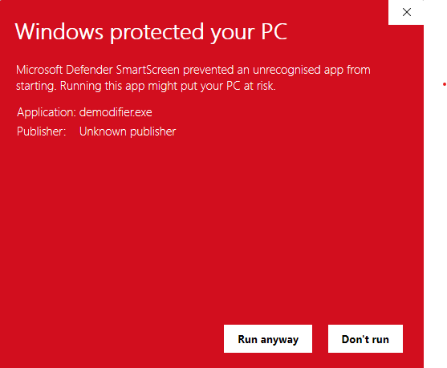

# The Demodifier

**The Demodifier** is a tool for processing peptide sequences to detect **Modification-Induced Sequence Permutations (MISPs)** caused by deamidation and N-terminal pyroglutamic acid (pyro-Glu) formation (Evans 2025). It automates the detection of peptides that may potentially be derived from multiple distinct taxonomies by generating all possible MISPs and retrieving their **Lowest Common Ancestor (LCA)** via the **Unipept API**. 


## What It Does

**The Demodifier** performs the following tasks:

1. **Generates all potential Modification-Induced Sequence Permutations (MISPs)** for a given peptide sequence, accounting for deamidation and pyro-Glu modifications.
2. **Queries the Unipept API** to retrieve the **LCA** for each MISP.
3. **Outputs the results** in CSV and JSON format for further investigation.

The tool is designed to automate the time-consuming process of manually generating MISP permutations and detecting peptides which could be derived from multiple distinct taxonomies, making this process faster and more accurate. The Demodifier only considers taxonomy on a per-peptide basis, meaning researchers must still consider overall protein taxonomy (given each peptide's LCA).

## Input

The Demodifier supports multiple input file types:

### 1. Simple CSV

A comma-separated file with a header row containing at least the following columns:

- **Sequence** — The unmodified peptide sequence.
- **Modifications** — The peptide modifications in MaxQuant or Mascot format.
  (Only deamidation and pyro-Glu are used for permutation generation; other modifications are ignored.)

### Example Simple CSV Layout

```csv
Sequence,Modifications
TPEVDNEALEK,Deamidated (NQ)
QEVGGEALGR,Gln->pyro-Glu
```

---

### 2. a MaxQuant evidence file

A tab-separated file with a `.txt` extension.

- Must contain **Sequence** and **Modifications** columns (or any of the alternate column names recognised by the script).
- Any other columns are ignored.

### 3. A Mascot output file

A CSV file that begins with several rows of metadata before the actual table.

- The true table must begin on the row where the **first column header is `prot_hit_num`**.
- That table must contain **pep_seq** and **pep_var_mod** (or their recognised alternates, e.g. `Sequence` / `Modifications`).
- All preamble rows are automatically skipped.

## Output

The Demodifier produces three output files (saved in the same directory as your input file):

 **`yourfilename_results.csv`** — Summary for each input peptide:
   - **Sequence**: Original peptide sequence.
   - **Modifications**: Original modifications.
   - **Input Peptide LCA**: The LCA for the input peptide.
   - **Total Unique Permutations (Count)**: Number of unique permutations generated.
   - **Permutations Yielding LCAs (Count)**: Number of permutations that returned a valid LCA.
   - **Permutations Yielding LCAs**: List of permutations that yielded LCAs.
   - **All Permutation LCAs**: A list of all LCAs yielded by a MISP of the input peptide.
   - **Identical LCAs**: A flag indicating if all LCAs are identical across permutations.
   - **Modification Location Inspection**: A flag indicating whether the modification location should be inspected to confirm which MISP LCA is supported for a given input peptide.

2. **`yourfilename_permutations.csv`** — Details of each MISP and its associated LCA (if available):
   - Contains each generated MISP and its associated LCA.

3. **`yourfilename_output.json`** — Detailed JSON output for downstream analysis:
   - Provides a nested results of the analysis, including all generated permutations and LCA data for each input peptide.

## How to Use

### Easiest method: Executable

The easiest way to run **The Demodifier** is as an executable. The executable has the correct Python versions and dependencies built in and requires minimal knowledge of the command line, particularly on Windows OS.

### Instructions for Windows:

1) **Download the windows exucutable zip folder**: 
Located in the releases section on the side bar

2) **Unzip the folder**

3) **Double click the executable**:
   This may trigger the pop up below, click *More info* and then *run anyway*

   

   

   this will open the command line, and a popup box for file selection

4) **Select your input file** in the pop up box

   

5) **Specify number of processors**
   On the command line, you will be asked:
   "How many processors?"

   Type the number of processors desired and press enter. 
   E.g. "4"

6) **Wait for analysis to finish**

The command line will display “Demodifier completed” when the analysis finishes.
The comand line window will close.
Output files will be located in the same directory as your input file.

### Instructions for Linux Executable

1) **Download the linux executable zip folder**: 
Located in the realeases section on the side bar

2) **Unzip the folder**

2) **On the command line, navigate to folder in which the executable is located**:

```bash
   cd ~/Demodifier/linux_exe
```

3) Make the file executable (if it won’t run yet)

```bash
   chmod +x demodifier
```

4) **Run the executable**

```bash
   ./demodifier
```
5) all other steps are the same as windows execution, outlined above

### Alternate method: Command Line

#### Installation

1. **Clone the repository**:
```bash
   git clone https://github.com/miranda-e/Demodifier
   cd Demodifier
```
2. **Install the required dependencies**:
```bash
   pip install -r requirements.txt
```
#### Note for Linux Users (source code only)

If you are running **The Demodifier** from source (via `python -m demodifier.main`) on Linux,  
you may need to install the `tkinter` package, which provides the graphical file picker window.

`tkinter` is part of the Python standard library, but it may not be included in minimal Linux installations.  
If you encounter an error such as:

```
ModuleNotFoundError: No module named 'tkinter'
```

install it using your package manager:

```bash
sudo apt-get install python3-tk
```

#### Running the Script

Navigate to the repository root (the folder that contains the `demodifier/` subfolder, which by default is called "Demodifier")

```bash
cd ~/Demodifier/
```

From the repository root
run the command: 

```bash
python -m demodifier.main
```

or specify a file directly:

```bash
python -m demodifier.main example.csv
```

If you run it without a filename, a GUI window will appear titled “Select a CSV or TXT file”. proceed, following executable tutorial above.

### Optional command-line flags

The Demodifier accepts optional flags to bypass interactive prompts.

```bash
python -m demodifier.main [input_file] [--threads N] [--verbose [yes|no]]
```

**Options:**

| Flag         | Description                                                          | Example                |
|--------------|----------------------------------------------------------------------|------------------------|
| `input_file` | *Optional:* Path to the input CSV or TXT file                        | `example.csv`          |
| `--threads`  | Number of processor threads to use. If omitted, you will be prompted | `--threads 4`          |
| `--verbose`  | Enables or disables detailed logging. Accepts `yes` or `no`. Bare `--verbose` = `yes`. **If using the bare flag, place it *after* the input file.** | `--verbose yes` or `--verbose` |

**Behavior:**
- If `--threads` is omitted → you’ll be asked **“How many processors?”**
- If `--verbose` is omitted → you’ll be asked **“Verbose mode on? (yes/no)”**
- If both are provided, the script won’t prompt and will respect your inputs.
- If no file is provided, a file picker will open first.

> **Important:**  
> When using the bare `--verbose` flag (without “yes” or “no”), the input file must come first — for example:  
> `python -m demodifier.main example.csv --verbose`  
> If you instead run `--verbose example.csv`, the program may think `example.csv` is the value for `--verbose` and open the file picker.

## Minimal Command Line Demo (using `example.csv`)

To quickly try out **The Demodifier**, you can use the provided `example.csv` file, which is located in the root of the repository.

1. Clone and install as above.
2. Run:
   ```bash
   python -m demodifier.main example.csv
   ```
3. Respond to prompts:
   ```
   How many processors?
   4
   ```
4. Wait for:
   ```
   Demodifier completed
   ```
   This will process the peptides in `example.csv` and output the following files in the same directory as the input file:
   - **`example_results.csv`**: Summary of permutations and LCAs.
   - **`example_permutations.csv`**: List of all permutations with their LCAs.
   - **`example_output.json`**: Detailed JSON data for further analysis.

### Contents of `example.csv`:

```csv
Sequence,Modifications
TPEVDDEALEKFDK,
TPEVDNEALEKFDK,Deamidated (NQ)
QVGAEALGR,Gln->pyro-Glu
QEVLNENLLR,Gln->pyro-Glu;2 Deamidated (NQ)
AAVEQLTEEQKNEFK,Deamidated (NQ)
EVLNENLLR,Deamidated (NQ)
```

This file contains several peptide sequences some of which have **deamidation** and **pyro-Glu** modifications. After running the script, you’ll find the output in the corresponding `.csv` and `.json` files mentioned above.

### Directory structure:
```
demodifier/
├── __init__.py
├── main.py          # Orchestrates analysis and output
├── analysis.py      # MISP permutation logic
├── unipept_api.py   # API interaction and LCA lookup
├── io_utils.py      # File input, including CSV/TSV readers
├── writers.py       # Output writers (CSV + JSON)
└── settings.py      # Logging, session setup, and CLI prompts
```

---

## Citation

Please cite the following works if you use **The Demodifier**:

1. **Evans (2025)**: "The Demodifier: a tool for screening modification-induced alternate peptide taxonomy in palaeoproteomics". Preprint: https://www.biorxiv.org/content/10.1101/2025.01.09.632126v2
2. **Mesuere et al. (2016)**: "Unipept web services for metaproteomics analysis". *Bioinformatics*, Volume 32, Issue 11, Pages 1746–1748: https://doi.org/10.1093/bioinformatics/btw039
3. **Vande Moortele et al. (2024)**: "Unipept in 2024: Expanding Metaproteomics Analysis with Support for Missed Cleavages, Semi-Tryptic and Non-Tryptic Peptides". *bioRxiv* 2024.09.26.615136: https://doi.org/10.1101/2024.09.26.615136

## License

This tool is open-source and licensed under the MIT License.