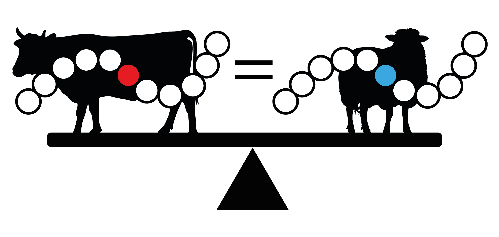

# The Demodifier

**The Demodifier** is a tool for processing peptide sequences to detect **Modification-Induced Sequence Permutations (MISPs)** caused by deamidation and N-terminal pyroglutamic acid (pyro-Glu) formation (Evans 2025). It automates the detection of peptides that may potentially be derived from multiple distinct taxonomies by generating all possible MISPs and retrieving their **Lowest Common Ancestor (LCA)** via the **Unipept API**. 



## What It Does

**The Demodifier** performs the following tasks:

1. **Generates all potential Modification-Induced Sequence Permutations (MISPs)** for a given peptide sequence, accounting for deamidation and pyro-Glu modifications.
2. **Queries the Unipept API** to retrieve the **LCA** for each MISP.
3. **Outputs the results** in CSV and JSON format for further investigation.

The tool is designed to automate the time-consuming process of manually generating MISP permutations and detecting peptides which could be derived from multiple distinct taxonomies, making this process faster and more accurate. The Demodifier only considers taxonomy on a per-peptide basis, meaning researchers must still consider overall protein taxonomy (given each peptide's LCA).

## Input

The Demodifier expects a **CSV** file with the following columns:

- **"Sequence"**: The unmodified peptide sequence.
- **"Modifications"**: The peptide modifications in **Maxquant** or **Mascot** format. Only **deamidation** and **pyro-Glu** modifications are currently supported for generating permutations; all other modifications will be ignored.

### Example CSV Layout:
```csv
Sequence,Modifications
TPEVDNEALEK,Deamidated (NQ)
QEVGGEALGR,Gln->pyro-Glu
```

## Output

The Demodifier produces the following files:

1. **`yourfilename_results.csv`** — Summary for each input peptide:
   - **Sequence**: Original peptide sequence.
   - **Modifications**: Original modifications.
   - **Input Peptide LCA**: The LCA for the input peptide.
   - **Total Unique Permutations (Count)**: Number of unique permutations generated.
   - **Permutations Yielding LCAs (Count)**: Number of permutations that returned a valid LCA.
   - **Permutations Yielding LCAs**: List of permutations that yielded LCAs.
   - **All Permutation LCAs**: A list of all LCAs yielded by a MISP of the input peptide.
   - **Identical LCAs**: A flag indicating if all LCAs are identical across permutations.
   - **Modification Location Inspection**: A flag indicating whether the modification location should be inspected to confirm which MISP LCA is supported for a given input peptide.

2. **`yourfilename_permutations.csv`** — Details of each MISP and its associated LCA (if available):
   - Contains each generated MISP and its associated LCA.

3. **`yourfilename_output.json`** — Detailed JSON output for downstream analysis:
   - Provides a more granular breakdown of the analysis, including all generated permutations and LCA data for each input peptide.

## How to Use

### Installation

1. **Clone the repository**:
   ```bash
   git clone https://github.com/miranda-e/Demodifier
   cd Demodifier
   ```

2. **Install the required dependencies**:
   ```bash
   pip install -r requirements.txt
   ```

### Running the Script

To run the script:

```bash
python3 demodifier.py input_peptides.csv --num-processors 4
```

- **`input_peptides.csv`**: The input CSV file containing peptide sequences and modifications.
- **`--num-processors`**: (Optional) The number of threads to use for parallel processing (default is 4).
- **`--verbose`**: (Optional) Additional verbosity for debugging.

## Minimal Tutorial Using `example.csv`

To quickly try out **The Demodifier**, you can use the provided `example.csv` file, which is located in the root of the repository.

### Steps:

1. **Clone the repository**:
   ```bash
   git clone https://github.com/miranda-e/Demodifier
   cd Demodifier
   ```

2. **Install the required dependencies**:
   ```bash
   pip install -r requirements.txt
   ```

3. **Run the script with the `example.csv` file**:
   ```bash
   python3 demodifier.py example.csv --num-processors 4
   ```

   This will process the peptides in `example.csv` and output the following files:
   - **`example_results.csv`**: Summary of permutations and LCAs.
   - **`example_permutations.csv`**: List of all permutations with their LCAs.
   - **`example_output.json`**: Detailed JSON data for further analysis.

### Contents of `example.csv`:

```csv
Sequence,Modifications
TPEVDDEALEKFDK,
TPEVDNEALEKFDK,Deamidated (NQ)
QVGAEALGR,Gln->pyro-Glu
QEVLNENLLR,Gln->pyro-Glu;2 Deamidated (NQ)
AAVEQLTEEQKNEFK,Deamidated (NQ)
EVLNENLLR,Deamidated (NQ)
```

This file contains several peptide sequences some of which have **deamidation** and **pyro-Glu** modifications. After running the script, you’ll find the output in the corresponding `.csv` and `.json` files mentioned above.

## Citation

Please cite the following papers if you use **The Demodifier** in your research:

1. **Evans (2025)**: "The Demodifier: a tool for screening modification-induced alternate peptide taxonomy in palaeoproteomics". Preprint: [https://www.biorxiv.org/content/10.1101/2025.01.09.632126v2](https://www.biorxiv.org/content/10.1101/2025.01.09.632126v2)
2. **Mesuere et al. (2016)**: "Unipept web services for metaproteomics analysis". *Bioinformatics*, Volume 32, Issue 11, Pages 1746–1748: [https://doi.org/10.1093/bioinformatics/btw039](https://doi.org/10.1093/bioinformatics/btw039)
3. **Vande Moortele et al. (2024)**: "Unipept in 2024: Expanding Metaproteomics Analysis with Support for Missed Cleavages, Semi-Tryptic and Non-Tryptic Peptides". *bioRxiv* 2024.09.26.615136: [https://doi.org/10.1101/2024.09.26.615136](https://doi.org/10.1101/2024.09.26.615136)

## License

This tool is open-source and licensed under the MIT License.

### Folder Structure
```
├── demodifier.py
├── requirements.txt
├── example.csv
└── README.md
```

